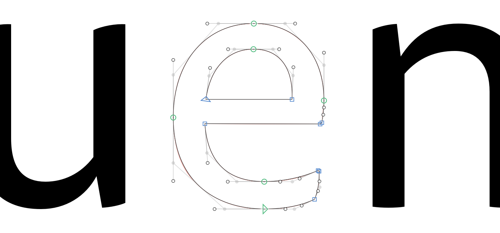
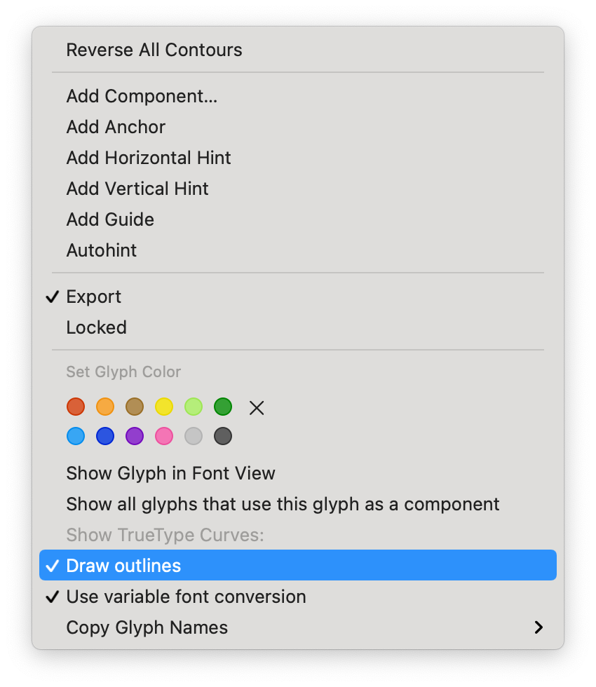

# Show TrueType Curves

This is a plugin for the [Glyphs font editor](https://glyphsapp.com/).  

This reporter plugin draws the contents of the active layer as quadratic curves in the background. This will give you an idea of how the points will be when exporting as TTF.

By default it uses the static font TT conversion, the same as running the command `Paths > Other > Convert to Quadratic`. You have the option to use the variable font TT conversion, which maintains the same number of nodes across all masters but is considerably slower for files with many masters.

### License

Copyright 2021 [Henrique Beier](https://www.harbortype.com) @harbortype

Made possible with the [GlyphsSDK](https://github.com/schriftgestalt/GlyphsSDK) by Georg Seifert (@schriftgestalt), Jan Gerner (@yanone) and Rainer Erich Scheichelbauer (@mekkablue). 

Licensed under the Apache License, Version 2.0 (the "License"); you may not use this file except in compliance with the License. You may obtain a copy of the License at

http://www.apache.org/licenses/LICENSE-2.0

See the License file included in this repository for further details.